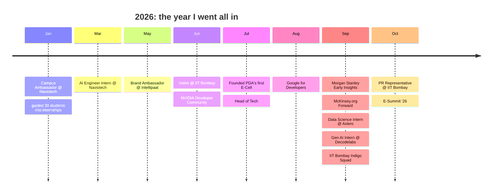

 

---

## 🏆 Credentials

---

## ⚡ Flagship Projects

<table>
<tr>
<td width="50%" valign="top">

### 🛰️ Chandrayaan-2 Image Correspondence
**SIH 2026 · ISRO · Team InnovX**
Sun-angle & scale-invariant matching across OHRC / TMC / IIRS lunar imagery.
7-stage pipeline: preprocessing → geometric normalization → multi-scale pyramid → SIFT → Lowe's ratio → RANSAC → accuracy metrics. Swappable **LoFTR** deep matcher.
`FastAPI` `Celery` `Redis` `PostgreSQL` `GDAL` `PyTorch` `kornia`

</td>
<td width="50%" valign="top">

### 🩸 Aarogya AI + RAKTA
Health-tech portal with **RAKTA**, a bloodless blood-test concept using optical sensing + AI.
`AI/ML` `Optical Sensing` `Health-Tech`

</td>
</tr>
<tr>
<td width="50%" valign="top">

### ⚖️ LexAI
Indian legal intelligence app with a built-in rights library, powered by the Claude API.
`Claude API` `LLM` `Web`

</td>
<td width="50%" valign="top">

### 🤖 JARVIS · Neural Nexus
Autonomous robot fusing CNN vision, LiDAR, Jetson Nano edge inference, PPO reinforcement learning and NLP.
`CNN` `LiDAR` `Jetson Nano` `PPO` `NLP`

</td>
</tr>
<tr>
<td colspan="2" valign="top">

### 🛠️ PDA FixMap — *See it. Scan it. Fix it.*
QR-based campus maintenance reporting. No-login reporting for students, dashboards for staff and admins, duplicate + priority detection, secure photo uploads.
`React` `TypeScript` `Tailwind` `Node.js` `Express` `PostgreSQL`

</td>
</tr>
</table>

<!-- Add repo links here as each project goes public -->

---

## 🧪 Machine Learning Lab

| Project | Result | Repo |
|---|---|---|
| 📉 Customer Churn | **80.9%** accuracy | [code](https://github.com/Shankar-Savalgi/Project-Customer-Churn) |
| 🏏 Cricket Player Clustering | K-Means on 79 players, elbow method, 3D plot | [code](https://github.com/Shankar-Savalgi/Project-Cricket-Player-Clustering-using-K-Means) |
| 🎗️ Breast Cancer + PCA | Noise cut, faster, less overfitting | [code](https://github.com/Shankar-Savalgi/Project-Optimizing-Breast-Cancer-Classification-via-Principal-Component-Analysis-PCA-) |
| 🦠 COVID-19 Forecasting | Prophet trend + seasonality | [code](https://github.com/Shankar-Savalgi/COVID-19-Analysis) |
| 🛒 Customer Conversion | **~89%** accuracy (Logistic Regression) | — |
| 🫀 Heart Disease Prediction | Decision Tree, 13 clinical features | — |
| 💰 Medical Cost Prediction | End-to-end Linear Regression pipeline | — |
| 🦯 Smart Shoes for the Blind | Assistive mobility tech | — |

---

## 🗺️ Journey

---

## 🧰 Arsenal

**Focus:** ML · NLP · RAG · LLMs · Computer Vision · Generative AI · Data Analytics

---

## 💼 Experience

<b>Open full timeline (11 roles)</b>

| Role | Org | When |
|---|---|---|
| Intern · Indigo Squad · PR Representative | **IIT Bombay** (Techfest) | Jun 2026 – Now |
| Data Science Intern | **Axlero Innovative Solutions** | Sep 2026 – Now |
| Head of Tech · Founding Board Member | **Venture Vanguard E-Cell** | Jul 2026 – Now |
| Early Insights Program | **Morgan Stanley** | Sep 2026 – Now |
| Forward Program | **McKinsey.org** | Sep 2026 – Now |
| Developer Community | **NVIDIA** | Jun 2026 – Now |
| Member | **Google for Developers** | Aug 2026 – Now |
| Gen AI Intern | **Decodelabs** | Sep – Oct 2026 |
| Brand Ambassador | **Intellipaat School of Technology** | May – Aug 2026 |
| AI Engineer Intern | **Naviotech Solution** | Mar – May 2026 |
| Campus Ambassador | **Naviotech Solution** | Jan – Mar 2026 |

## 🎓 Education

- **B.E. AI & ML** · PDA College of Engineering, Kalaburagi · 2025–2029
- **AI & Data Science** · Drishti CPS, IIT Indore
- **PU (Science)** · Shree Guru Independent College of Science · 2023–2025

🌐 **Languages:** English · Hindi · Kannada · Sanskrit

---

## 📊 GitHub Analytics

---

### 🎯 Open to: AI/ML internships · Research collabs · Hackathons · Open-source

*Learn → Build → Ship → Repeat.*

